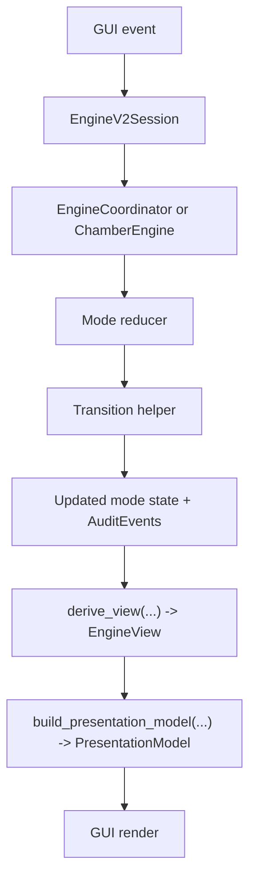
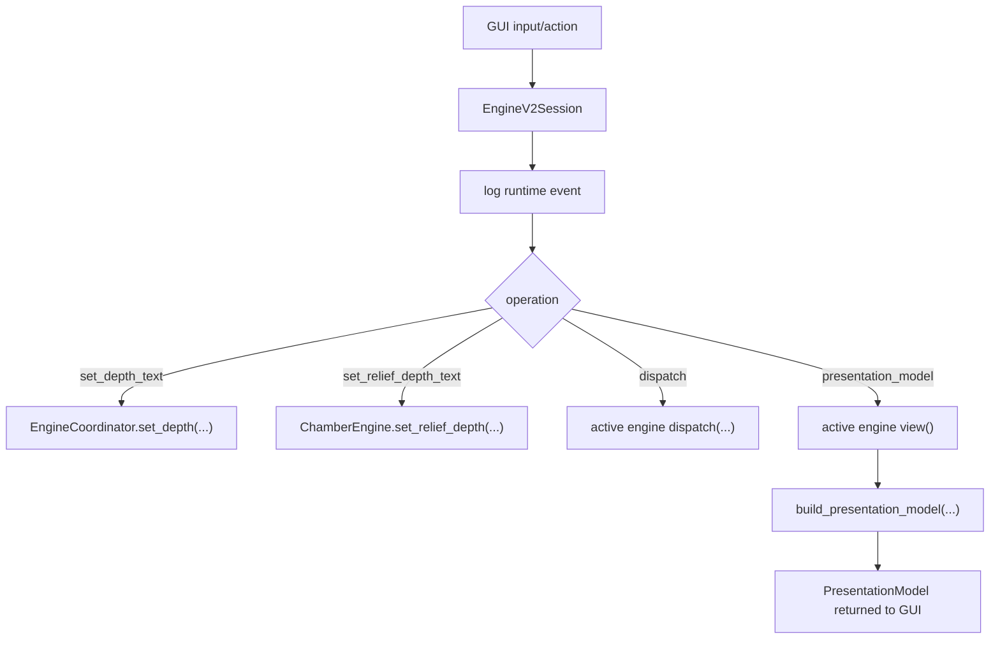
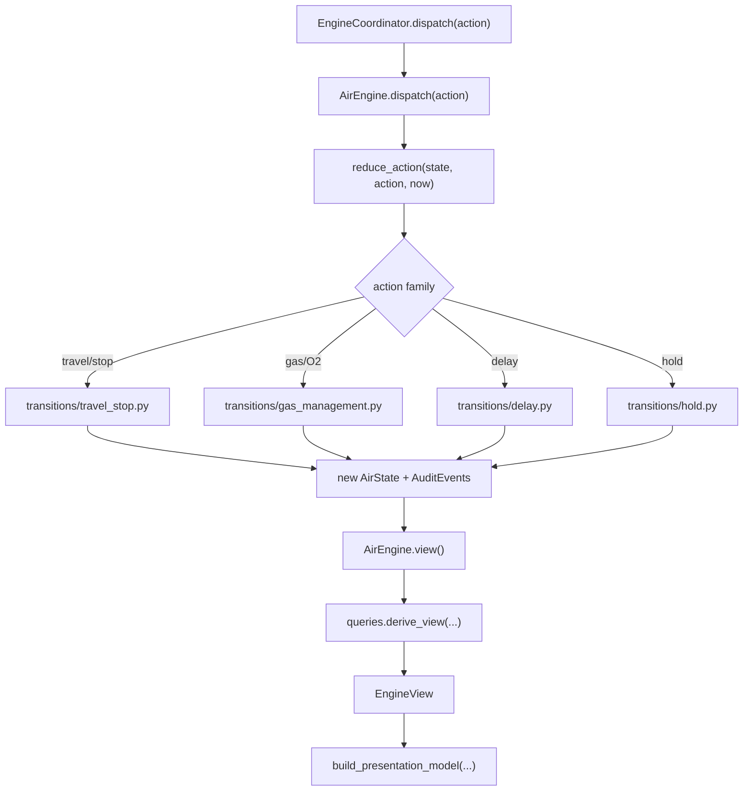
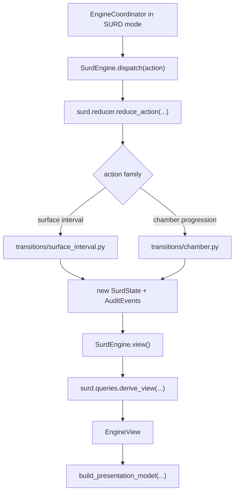
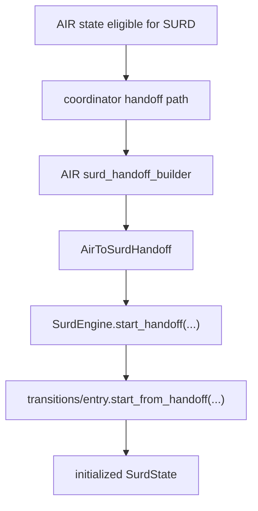
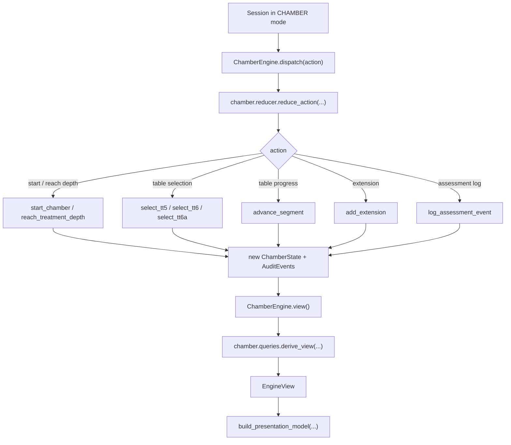
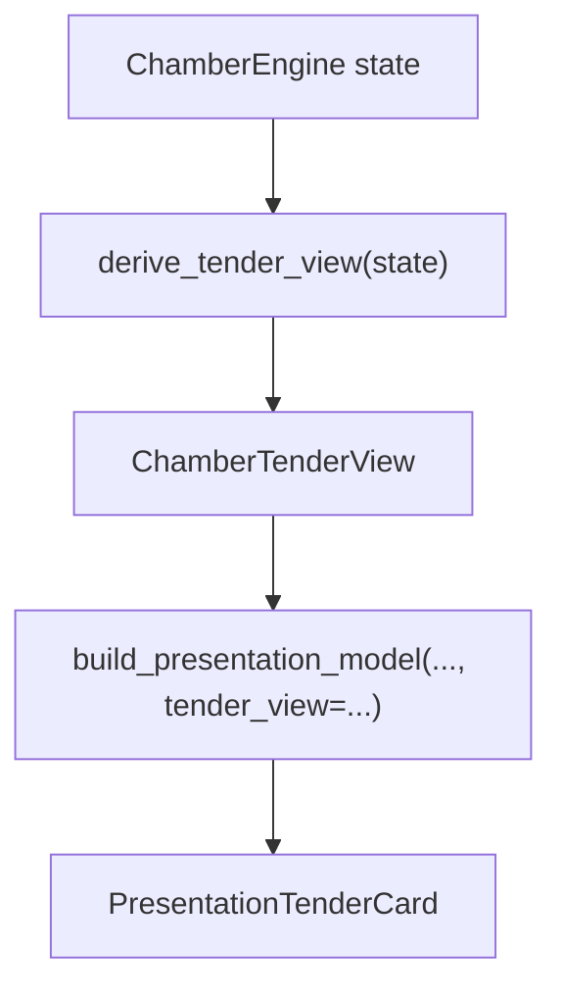
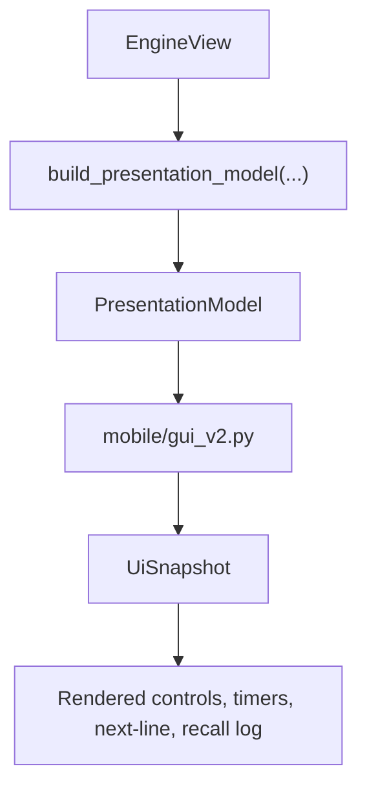

# Engine V2 Runtime Call Graphs

This document shows the normal runtime call flow through `engine_v2`.

Purpose:
- make backend flow easier to reason about
- show where a bug belongs
- help decide whether a change belongs in:
  - session/runtime orchestration
  - a mode reducer/transition
  - query/view derivation
  - presentation/GUI projection

## How To Use This

When a behavior is wrong, classify the symptom first:

- wrong state transition
  - inspect reducer + transition helper
- wrong available action
  - inspect query layer
- wrong timer/depth display
  - inspect query layer first, then presentation
- wrong button priority/wording/color
  - inspect presentation builder
- wrong mode switch / handoff
  - inspect coordinator or handoff builder

## Top-Level Runtime Flow

## Session Flow

File: [src/dive_stopwatch/engine_v2/runtime/session.py](/Users/iananderson/projects/DiveStopwatchProject/src/dive_stopwatch/engine_v2/runtime/session.py)

Notes:
- Session owns:
  - mode launch
  - test-time offset
  - runtime action/input log
  - final presentation-model assembly
- Session does not own procedure semantics.

## AIR / AIR_O2 Runtime Flow

### AIR Action Flow

### AIR Main Files By Responsibility

- runtime shell
  - [src/dive_stopwatch/engine_v2/modes/air/engine.py](/Users/iananderson/projects/DiveStopwatchProject/src/dive_stopwatch/engine_v2/modes/air/engine.py)
- action router
  - [src/dive_stopwatch/engine_v2/modes/air/reducer.py](/Users/iananderson/projects/DiveStopwatchProject/src/dive_stopwatch/engine_v2/modes/air/reducer.py)
- travel / stop state changes
  - [src/dive_stopwatch/engine_v2/modes/air/transitions/travel_stop.py](/Users/iananderson/projects/DiveStopwatchProject/src/dive_stopwatch/engine_v2/modes/air/transitions/travel_stop.py)
- O2 / air break / convert-to-air
  - [src/dive_stopwatch/engine_v2/modes/air/transitions/gas_management.py](/Users/iananderson/projects/DiveStopwatchProject/src/dive_stopwatch/engine_v2/modes/air/transitions/gas_management.py)
- ascent delay logic
  - [src/dive_stopwatch/engine_v2/modes/air/transitions/delay.py](/Users/iananderson/projects/DiveStopwatchProject/src/dive_stopwatch/engine_v2/modes/air/transitions/delay.py)
- descent hold logic
  - [src/dive_stopwatch/engine_v2/modes/air/transitions/hold.py](/Users/iananderson/projects/DiveStopwatchProject/src/dive_stopwatch/engine_v2/modes/air/transitions/hold.py)
- semantic view derivation
  - [src/dive_stopwatch/engine_v2/modes/air/queries.py](/Users/iananderson/projects/DiveStopwatchProject/src/dive_stopwatch/engine_v2/modes/air/queries.py)
- timer / O2 rule helpers
  - [src/dive_stopwatch/engine_v2/modes/air/rules.py](/Users/iananderson/projects/DiveStopwatchProject/src/dive_stopwatch/engine_v2/modes/air/rules.py)
- decompression-profile build
  - [src/dive_stopwatch/engine_v2/modes/air/plan.py](/Users/iananderson/projects/DiveStopwatchProject/src/dive_stopwatch/engine_v2/modes/air/plan.py)

### AIR Common Bug Routing

- wrong stop schedule after `LB`
  - start in `transitions/travel_stop.py:leave_bottom`
  - then inspect `plan.py`
- wrong O2 stop timing / air break timing
  - start in `gas_management.py`
  - then inspect `rules.py` and `queries.py`
- wrong depth while descending/traveling/delayed
  - inspect `queries.py:_display_depth_fsw`
- wrong line-2 timer
  - inspect `queries.py:_active_timer_view`
- wrong line-5 text/color
  - inspect `presentation_builder.py:_summary_text` and `_summary_kind`

## SURD Runtime Flow

### SURD Entry/Handoff Flow

### SURD Common Bug Routing

- wrong surface-interval branch / penalty
  - inspect `transitions/surface_interval.py`
  - then `surd/rules.py:surface_interval_penalty_kind`
- wrong chamber segment progression
  - inspect `transitions/chamber.py`
  - then `surd/plan.py`
- wrong SURD depth/timer display
  - inspect `surd/queries.py`

## CHAMBER Runtime Flow

### CHAMBER Secondary Tender Flow

### CHAMBER Common Bug Routing

- wrong table segment sequence
  - inspect `chamber/plan.py`
  - then `chamber/rules.py`
- wrong legal action at 60 fsw
  - inspect `chamber/queries.py:_available_actions`
- wrong selected-table execution
  - inspect `chamber/reducer.py:_select_table`
- wrong tender card
  - inspect `chamber/tender.py`

## Presentation / GUI Flow

### Presentation Layer Responsibilities

File: [src/dive_stopwatch/engine_v2/projection/presentation_builder.py](/Users/iananderson/projects/DiveStopwatchProject/src/dive_stopwatch/engine_v2/projection/presentation_builder.py)

Owns:
- line labels and wording
- primary/secondary action prioritization
- line-5 `Next` text
- line-5 semantic color classification
- recall/event-log row formatting

Does not own:
- actual legality of actions
- schedule generation
- timer math
- decompression/chamber procedure rules

### GUI Layer Responsibilities

File: [src/dive_stopwatch/mobile/gui_v2.py](/Users/iananderson/projects/DiveStopwatchProject/src/dive_stopwatch/mobile/gui_v2.py)

Owns:
- control layout
- mode cycling shell behavior
- text field wiring
- test-time button wiring
- applying presentation colors/styles

Does not own:
- decompression logic
- O2 timing logic
- chamber-table logic
- SURD penalty logic

## Practical Debug Triage

### If a button is wrong

Check in order:

1. `queries.py:_available_actions`
2. `presentation_builder.py:_prioritized_actions`
3. `presentation_builder.py:_action_label`
4. `mobile/gui_v2.py`

### If a timer is wrong

Check in order:

1. mode `queries.py:_active_timer_view`
2. shared/shared-mode timer helper (`contracts/timers.py`, mode `rules.py`)
3. `presentation_builder.py:_primary_value` or `_depth_timer_label`

### If depth is wrong

Check in order:

1. mode `queries.py:_display_depth_fsw`
2. `domain/depth.py`
3. `presentation_builder.py:_depth_inline_text`

### If line 5 is wrong

Check in order:

1. `presentation_builder.py:_summary_text`
2. `presentation_builder.py:_summary_kind`
3. upstream `EngineView` fields that feed them

### If the runtime log is wrong

Check in order:

1. `runtime/session.py` for action/input/test-time logging
2. transition helper event emission
3. `presentation_builder.py:_event_summary`
4. `mobile/gui_v2.py` recall rendering

## Suggested AIR Debug Path

For AIR/AIR_O2 parity, the fastest useful reading sequence is:

1. [src/dive_stopwatch/engine_v2/runtime/session.py](/Users/iananderson/projects/DiveStopwatchProject/src/dive_stopwatch/engine_v2/runtime/session.py)
2. [src/dive_stopwatch/engine_v2/runtime/coordinator.py](/Users/iananderson/projects/DiveStopwatchProject/src/dive_stopwatch/engine_v2/runtime/coordinator.py)
3. [src/dive_stopwatch/engine_v2/modes/air/reducer.py](/Users/iananderson/projects/DiveStopwatchProject/src/dive_stopwatch/engine_v2/modes/air/reducer.py)
4. [src/dive_stopwatch/engine_v2/modes/air/transitions/travel_stop.py](/Users/iananderson/projects/DiveStopwatchProject/src/dive_stopwatch/engine_v2/modes/air/transitions/travel_stop.py)
5. [src/dive_stopwatch/engine_v2/modes/air/transitions/gas_management.py](/Users/iananderson/projects/DiveStopwatchProject/src/dive_stopwatch/engine_v2/modes/air/transitions/gas_management.py)
6. [src/dive_stopwatch/engine_v2/modes/air/transitions/delay.py](/Users/iananderson/projects/DiveStopwatchProject/src/dive_stopwatch/engine_v2/modes/air/transitions/delay.py)
7. [src/dive_stopwatch/engine_v2/modes/air/queries.py](/Users/iananderson/projects/DiveStopwatchProject/src/dive_stopwatch/engine_v2/modes/air/queries.py)
8. [src/dive_stopwatch/engine_v2/projection/presentation_builder.py](/Users/iananderson/projects/DiveStopwatchProject/src/dive_stopwatch/engine_v2/projection/presentation_builder.py)

That gives you the whole path from action -> state change -> displayed behavior.
